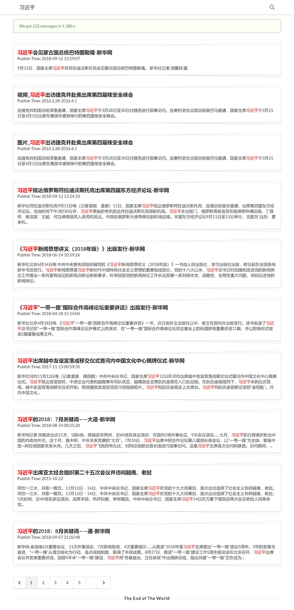
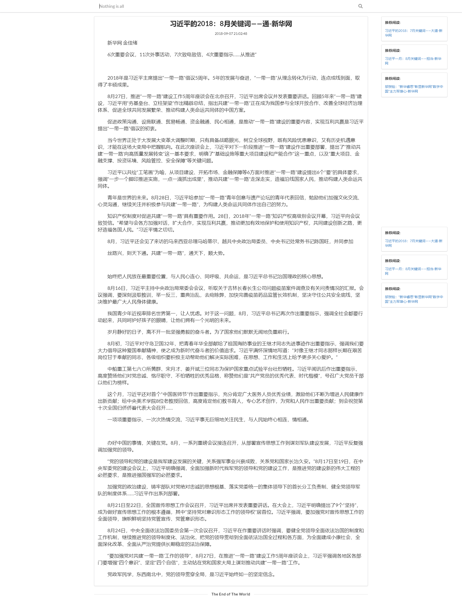

## Documentation
- [Documentation](#documentation)
- [Introduction](#introduction)
- [Functionality](#functionality)
- [Statistics](#statistics)
- [Algorithm](#algorithm)
- [License](#license)
## Introduction

本项目是2017-2018夏季学期程序设计基础小学期第三周大作业, 基于[Django](https://www.djangoproject.com/), [Jinja2](http://jinja.pocoo.org/docs/2.10/)及[Semantic-UI](https://semantic-ui.com/), 实现了一个作业级的新闻搜索引擎.

## Functionality
- 爬虫
- 搜索引擎
    - 支持根据时间区间(以日为元单位的闭区间)查询
    - 对查询关键词支持高亮显示
    - 分页系统
- 新闻推荐

搜索界面(iPad Pro):

新闻详情页(Windows 10):

## Statistics
总新闻量: 在[新华网](http://www.xinhuanet.com/)爬取了4k条新闻.

查询时间: 0.2s
## Algorithm
- 搜索引擎
    1. 预处理: 使用TF-IDF算法滤过每条新闻, 保留至多20条权重最高的词语.
    2. 使用[jieba](https://github.com/fxsjy/jieba)对待查询字符串深度分词.
    3. 将待查询字符串视作以词语为下标, 出现频率(或TF-IDF权重)为权值的向量$A$, 以同样的方式, 将第$i$篇文章的标题和内容(至多20条权重最高的词语)视作向量$B_i, C_i$, 以$(A \cdot B_i, A \cdot C_i)$来衡量文章$i$与待查询字符串的**吻合度**.
    4. 若吻合度不为0, 则认为该新闻可以响应待查询字符串, 将所有新闻以吻合度逆序排列.
- 新闻推荐: 根据文章的标题使用与搜索引擎类似的算法生成三条吻合度最高的推荐新闻.

## License

依据[MIT](LICENSE.md)协议开源